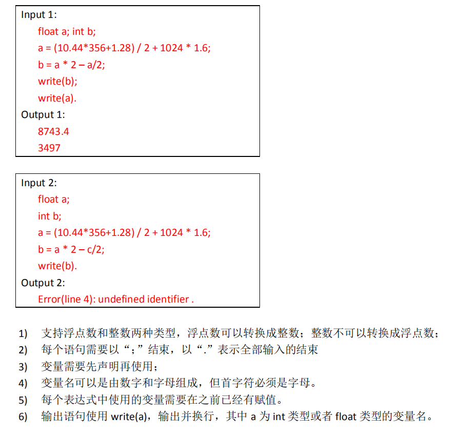

**要求**:

**文件**: 
* calculator.c: 完整代码 
* cal.c: 用来测试和debug的完整代码, 格式比较混乱
* test.txt: 输入文件
* description.md 文法定义(或者是普通的实现思路说明)

**用法**: `calculator.exe test.txt`

**个人补充规定**: 
* 空格会被忽略
* 不允许使用int a = 1;的形式, 允许int a,b,c;
* 支持单行注释//, 但是结束符`.`后面不能有任何字符包括换行符
* 变量只能以字母开头
* 只支持十进制
* 支持负数, 例如 `-1 * 2`, `(-1) * 2`, (-1 * 2)
* 表达式计算部分采用修改过的逆波兰表达式方法进行计算, 返回值均为`float`, 如果需要赋值给整数需要调用函数自行转换
* 重写了`string.h`中的`strcmp`, `strlen`, `strcpy`,`strncpy`. 以宏的形式重写了`assert`, 仅使用了`stdio.h`和`stdlib.h`
* 支持`+ - * / ( )`
* 由于采用每行处理一次tokens的方法, 对于多行函数要将tokens放在一起处理, 此时比较难判断出错在第几行

这只是第一次作业, 对编译原理没什么理解, 做出来的东西也不太符合编译原理, 如果有不对还望指导.
